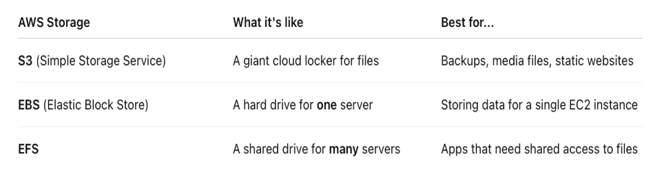
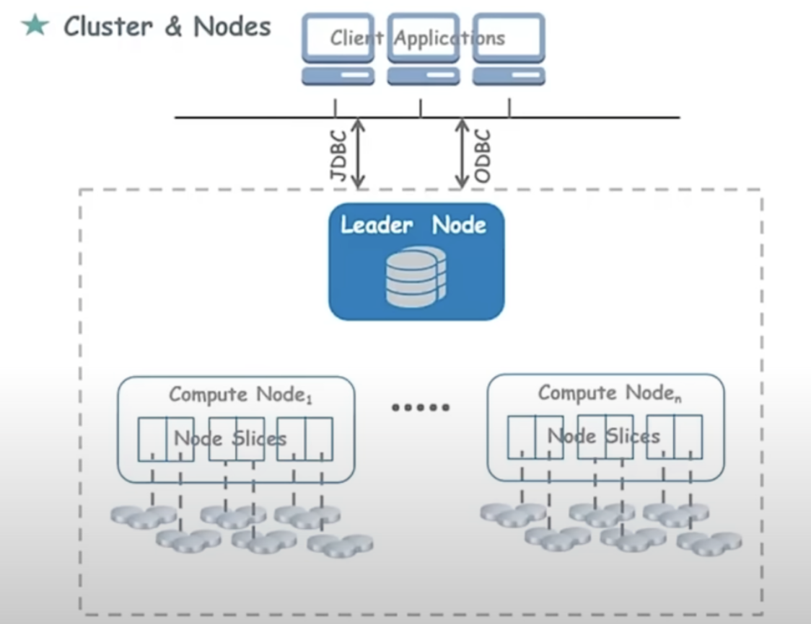

## What is an EC2 Instance?
An **EC2 (Elastic Compute Cloud) Instance** is a virtual server in the cloud that provides resizable compute capacity.

## Difference Between EC2 and Elastic Beanstalk
* **EC2 Instance:** A clean slate. You get infrastructure-as-a-service (IaaS), meaning you must manually configure the operating system, network, and install required software or libraries.
* **Elastic Beanstalk:** A platform-as-a-service (PaaS). It comes with predefined libraries, runtime environments, and automated provisioning (like load balancing and auto-scaling), allowing you to deploy apps without worrying about the underlying infrastructure.

---

## Types of EC2 Instances

### General Purpose
* Optimized for a balance of compute, memory, and networking resources.
* Best for applications requiring prompt responses, cost-effectiveness, and balanced processing (e.g., web servers, small databases).

### Compute Optimized
* Engineered for applications that require a lot of processing power from the CPU.
* Best for high-performance front-end servers, data analytics, and analyzing streaming data.

### Memory Optimized
* Designed to deliver fast performance for workloads that process large datasets in memory (RAM).
* Best for open-source databases, real-time big data analytics, and running large-scale caches.

### Storage Optimized
* Tailored for workloads that require high, sequential read and write access to very large datasets on local storage.
* Best for distributed file systems, data warehousing, and large-sized transactional databases.

### Accelerated Computing (GPU)
* Utilizes hardware accelerators (GPUs or FPGAs) to perform functions like co-processing and graphics acceleration.
* Best for heavy graphics rendering, machine learning, and 3D visualizations.

---

## EC2 Instance Pricing Models

### On-Demand
* You pay for compute capacity by the second or hour with no long-term commitments.
* The instance stays active until you choose to stop or terminate it yourself (it does not automatically delete after 1 hour).

### Dedicated Hosts / Instances
* Physical EC2 servers fully dedicated to a single organization.
* Offers high security, strict hardware isolation from other AWS vendors, and helps meet compliance or licensing requirements.

### Spot Instances
* Allows you to bid on or utilize unused AWS spare capacity at steep discounts (up to 90% off On-Demand prices).
* The instance can be reclaimed and interrupted by AWS with a 2-minute warning if they need the capacity back.

### Reserved Instances (and Savings Plans)
* Provides a significant discount (up to 72%) compared to On-Demand pricing in exchange for a commitment to a consistent amount of usage for a 1 or 3-year term.
* Allows you to plan long-term costs while still maintaining the ability to upscale or downscale capacity as needed.

## EC2 Instance Features Based on Functioning

### Burstable Performance Instances
* **Definition:** A category of General Purpose instances designed to provide a baseline level of CPU performance with the ability to burst above that baseline when needed.
* **How it works:** They accumulate "CPU credits" when running below their baseline performance. When workloads spike, they spend these credits to burst to higher capacity. If you run out of credits, performance throttles back to the baseline.
* **Use Case:** Applications where data and traffic are not constant, such as customer data analysis tools, small web servers, or development environments.

### EBS-Optimized Instances
* **Definition:** Instances designed to maximize Amazon Elastic Block Store (EBS) performance by providing dedicated throughput between the EC2 instance and the EBS volume.
* **Benefit:** Eliminates network contention between EBS I/O and other network traffic from your instance, ensuring data processes at higher and more consistent speeds.
* **Use Case:** High-throughput transactional workloads, active database management systems, or automated systems like high-frequency email auto-responders.

### Cluster Networking (Placement Groups)
* **Definition:** A configuration strategy that forms clusters of instances to meet low-latency and high-throughput networking needs.
* **How it works:** Instances are strategically placed within logical groups (like Cluster, Partition, or Spread placement groups) to optimize data transfer or ensure hardware isolation across multiple instances serving different purposes.
* **Use Case:** High-Performance Computing (HPC), tightly coupled node applications, and distributed distributed systems like search engine indexing and big data browsing.

### Dedicated Instances / Hosts
* **Definition:** Instances that run on physical hardware dedicated strictly to a single customer account or organization.
* **Benefit:** Provides complete hardware-level isolation, maximizing security, data privacy, and compliance.
* **Use Case:** Confidential data processing, government compliance workloads, and strict corporate privacy frameworks.

---

## Amazon Machine Image (AMI)
* **Definition:** An **AMI (Amazon Machine Image)** is a pre-configured template used to launch an EC2 instance.
* **What it contains:** It packages the operating system, an application server, and any necessary pre-installed software and permissions.
* **Reusability:** You can use a single AMI to launch as many identical, independent new instances as your infrastructure requires.

## AWS Lambda
**AWS Lambda** is a serverless, event-driven compute service used to automate tasks by executing code in response to specific triggers without provisioning or managing servers.

### Key Characteristics
* **Event-Driven Execution:** Functions are automatically triggered based on defined actions, such as uploading files, database updates, or HTTP requests.
* **Granular Automation:** Composes precise workflows, such as parsing an object uploaded to an S3 bucket or passing events downstream to other services.

### Event Trigger Example (S3 to Lambda Workflow)
A typical automation pattern involves linking an Amazon S3 storage bucket directly to a Lambda function to process newly added data seamlessly:
* **S3 Event Configuration:** An event notification is created within an S3 bucket's properties using the **`PUT` object option**, which tracks any new file uploads.
* **Asynchronous Execution:** When a file is uploaded, S3 fires an event notification that asynchronously invokes the targeted Lambda function.
* **Data Processing & Logging:** The triggered Lambda function extracts parameters from the event metadata—specifically the **bucket name** and the object's **file key**—to parse, decode, and print or process the uploaded file's contents (e.g., viewing structured JSON data).
* **Multi-Service Chaining:** The action can chain across other services, such as utilizing the **Amazon SNS (Simple Notification Service)** to automatically dispatch emails to designated addresses upon a successful trigger event.

---

## AWS Elastic Beanstalk
**AWS Elastic Beanstalk** is an easy-to-use Platform as a Service (PaaS) designed for deploying and scaling web applications and services developed with popular runtimes and languages.

### Core Architecture & Capabilities
* **Automated Application Deployment:** Simplifies deployment by handling the underlying infrastructure details, making applications publicly accessible immediately after a bundle upload.
* **Elastic Resource Scaling:** Automatically provisions resources up or down to dynamically match traffic fluctuations and application performance requirements.
* **Monitoring and Alerting:** Built-in health monitoring, metrics collection, and automated alerts to continuously log and manage ecosystem stability.
* **Multi-Environment Architecture:** Supports running independent copies of an application simultaneously across isolated boundaries (e.g., distinct **Development (Dev)**, **Testing (Test)**, and **Production (Prod)** environments).
* **Environment-Specific Isolation:** Structurally segments logical environments into distinct deployment pipelines, mapping unique environmental configurations and software folders for cleaner workspace management.

# Amazon Simple Storage Service (S3)

* **Bucket:** A logical container for storing objects in Amazon S3. 
* **Object:** The fundamental entity stored in Amazon S3, consisting of object data (the file itself) and metadata.
* **Metadata Components:** 
  * **Key:** The unique name assigned to an object within a bucket, serving as its identifier.
  * **Version ID:** A unique identifier assigned to an object variant when S3 Versioning is enabled.

---

## Data Management and Architecture

### Global Infrastructure Namespace
* **Global Namespace:** S3 bucket names must be globally unique across all AWS accounts worldwide.
* **Regional Storage:** While the namespace is global, individual buckets are created within a specific AWS region to comply with data residency and latency requirements.

### S3 Versioning
* **Purpose:** Maintains multiple variants of an object within the same bucket.
* **Benefits:** 
  * Tracks historical object mutations and overwrites.
  * Enables seamless rollback to older object versions.
  * Protects against accidental deletions (retaining previous states via delete markers).

### Cross-Region Replication (CRR)
* **Mechanism:** Automatically and asynchronously copies objects across S3 buckets located in different geographical AWS regions.
* **Use Case (Redundancy & High Availability):** To achieve robust storage redundancy, you can configure target buckets across two distinct regions and automate CRR to ensure high durability and disaster recovery readiness.

### Lifecycle Policies
* **Mechanism:** Automates the transition of objects between distinct storage classes over time based on predefined age criteria or prefixes.
* **Use Case (Cost Optimization):** To optimize S3 expenditure, lifecycle rules can dynamically transition older, less frequently accessed objects to lower-cost storage classes (such as Amazon S3 Glacier) where storage fees are significantly reduced.

---

## S3 Transfer Acceleration & Performance

### S3 Transfer Acceleration (S3TA)
* **Purpose:** Enables fast, easy, and secure transfers of files over long distances between your client and an S3 bucket.
* **Mechanism:** Bypasses public internet routing over long distances by leveraging AWS Edge Locations to ingest data close to the client.

### Amazon CloudFront Integration
* **Edge Locations:** S3TA routes data through Amazon CloudFront's globally distributed network of Edge Locations.
* **Optimization Path:** Data traveling from the client is ingested at the nearest Edge Location and is then routed to the destination S3 bucket over the high-speed, optimized AWS private network backbone, minimizing latency.

# AWS Elastic File System (EFS)

## What is AWS EFS?
**Amazon Elastic File System (Amazon EFS)** is a fully managed, serverless, and scalable file storage service provided by AWS. It acts like a **shared, internet-connected hard drive** in the cloud that multiple servers can connect to and access simultaneously.

---

## The Shared Drive Analogy
Imagine you have a team working on a joint project—**Alice, Bob, and Carol**:
* They all need to access the exact same folder of documents, regardless of which computer or location they are working from.
* Instead of copying the folder to each individual computer (which creates version issues and wastes storage), you place that folder in the cloud using **EFS**.
* Everyone can open, edit, and access the files together in real time. 

This is exactly how EFS works for infrastructure: it acts as a centralized, shared drive for your cloud resources.

---

## Core Characteristics & Functionality

* **Shared Access:** EFS uses a file system architecture (organized into standard folders and files) that can be simultaneously mounted (connected) to **multiple EC2 instances** or on-premises servers.
* **Elastic & Scalable:** It automatically scales up or down as you add or remove files. There is no need to pre-provision storage capacity, and you only pay for what you use.
* **Fully Managed:** It is fully managed by AWS. You do not have to worry about deploying file servers, patching operating systems, or managing complex hardware storage arrays.
* **High Availability & Durability:** EFS stores data across multiple Availability Zones (AZs) by default, offering strong data resilience and performance consistency for shared application workloads.

# AWS Storage and Networking Fundamentals

## Amazon S3 Glacier
* **Purpose:** A secure, durable, and low-cost storage class designed specifically for data archiving and long-term backup of infrequently accessed data.
* **Retrieval Times:** Data retrieval is not instantaneous; depending on the tier chosen (Expedited, Standard, or Bulk), access times can range from a few minutes to several hours.
* **Cost Optimization:** Significantly less expensive than standard Amazon S3 storage classes, making it ideal for regulatory compliance logs or historical archives.

---

## AWS Storage Gateway
* **Purpose:** A hybrid cloud storage service that bridges the gap between your on-premises environments and the AWS cloud.
* **Functionality:** Allows local applications to seamlessly connect to and store data in AWS storage services (like S3, EBS, or Glacier) for backup, archiving, or disaster recovery.

---

## Amazon Elastic Block Store (EBS)
* **Definition:** Provides scalable, high-performance block storage volumes designed specifically for use with **Amazon EC2 instances** (virtual machines).

### EBS Volumes
* **Behavior:** Acts as an external, network-attached virtual hard drive. Once attached to an EC2 instance, it can be formatted with a file system and used exactly like a local physical drive.
* **Proximity Constraint:** An EBS volume and its corresponding EC2 instance must reside in the same **Availability Zone (AZ)** to ensure low-latency performance and avoid network bottlenecks.

### EBS Snapshots
* **Backup Mechanism:** Point-in-time, incremental backups of your EBS volumes.
* **Independence:** Snapshots are decoupled and stored independently in Amazon S3; if the original EBS volume is deleted or corrupted, the snapshot remains perfectly intact.
* **Automation:** Snapshot creation can be fully automated on a customized schedule using tools like **AWS Data Lifecycle Manager (DLM)**.

---

## Amazon Virtual Private Cloud (VPC)
* **Definition:** A logically isolated, private virtual network dedicated exclusively to your AWS account.
* **Functionality:** Provides complete control over your virtual networking environment, acting as the structural foundation where you securely launch, isolate, and manage your AWS resources (like EC2 instances and databases).

---

## AWS Direct Connect
* **Definition:** A cloud service solution that establishes a dedicated, private network link from your on-premises data center or office directly to AWS.
* **Bypassing the Internet:** It does not use the public internet. Instead, it provides a physical **leased line** connection that delivers more consistent network performance, lower latency, and reduced bandwidth costs compared to traditional internet-based VPNs.

---

## Amazon Route 53
* **Definition:** A highly available and scalable Cloud Domain Name System (**DNS**) web service.
* **Mechanism:** Translates human-readable web addresses (e.g., `www.example.com`) entered by a client browser into the numerical IP addresses (e.g., `192.0.2.1`) that computers use to connect to each other.

## Amazon CloudFront Distribution
* **Definition:** A fast, highly secure Content Delivery Network (CDN) web service that speeds up the distribution of your static and dynamic web content to end-users globally.
* **Mechanism:** Delivers content through a worldwide network of data centers called **Edge Locations**. When a user requests content, CloudFront routes the request to the edge location that provides the lowest latency.
* **Regional Edge Caches:** Positioned between your origin servers and edge locations, these regional caches maintain larger subsets of content that are less frequently requested, reducing the burden on your origin server while maintaining quick fetch times.
* **Origin Definition:** The central, definitive storage location (such as an Amazon S3 bucket, an EC2 instance, or an Elastic Load Balancer) where the original, complete versions of your web content reside. CloudFront pulls content from here to populate its edge caches.

---

## AWS CloudFormation
* **Definition:** An Infrastructure as Code (IaC) service that allows you to model, provision, and manage a collection of related AWS and third-party resources predictably and repeatedly.
* **Declarative Templates:** You write blueprint templates using JSON or YAML to explicitly define all required AWS resources, configurations, and dependencies.
* **Visual Designer:** Offers a drag-and-drop design tool to visually model architecture, which automatically outputs the structural JSON/YAML blueprint template.
* **Stacks and Replication:** Resources are managed as a single unit called a **Stack**. A completed template can be effortlessly replicated to deploy identical, production-ready environments across different regions or accounts.

---

## Amazon CloudWatch
* **Definition:** A comprehensive monitoring and management service that provides real-time data, insights, and actionable visibility for AWS resources and applications.
* **Importance of Monitoring:**
    * **Performance Visibility:** Delivers granular performance analytics for cloud-native applications.
    * **Cost Management:** Highlights underutilized infrastructure to help eliminate unnecessary operational expenses.
    * **Proactive Triage:** Detects anomalies and infrastructure degradations early to prevent widespread outages.
* **Monitoring Tiers:**
    * **Basic Monitoring:** Enabled by default and provided at no additional cost. Metrics are typically sent automatically at a 5-minute frequency with standard dashboard capabilities.
    * **Detailed Monitoring:** An opt-in feature available for an extra charge. Provides higher resolution data tracking with metrics delivered at a 1-minute frequency.
* **Core Functions:**
    * **Collect & Track Metrics:** Monitors system statistics and data points representing resource health (e.g., CPU utilization, disk reads/writes, network in/out).
    * **Log Management:** Aggregates, searches, monitors, and archives server and application log files securely.
    * **Alarms & Notifications:** Triggers alarms when specific threshold conditions are broken, pushing notifications via Amazon SNS or triggering scaling actions.
    * **Event-Driven Automation:** Captures system state changes as events and routes them to targets like AWS Lambda or SNS to automate operational work.

    

    * **CloudWatch Events:** Delivers a near real-time stream of system events that describe changes in your AWS resources, allowing you to automatically trigger responsive actions (like invoking a Lambda function) when state changes occur.
* **CloudWatch Logs:** Centralizes the monitoring, storage, and retrieval of log files originating from AWS resources (such as EC2 instances, CloudTrail, or Route 53), making it easy to troubleshoot system behavior.

---

## Auto-Scaling and Elastic Load Balancing

### Infrastructure Foundations
* **EBS Snapshots:** Act as localized point-in-time backups of specific block storage volumes (similar to saving data on a flash drive).
* **Amazon Machine Images (AMIs):** Serve as comprehensive master templates (operating system, pre-installed software, and configurations) required to boot up a fresh EC2 instance. You can build custom AMIs tailored to your exact application requirements.

### Dynamic Fleet Scaling
* **AWS Auto Scaling:** Analyzes real-time metrics (like CPU utilization) to automatically launch or terminate EC2 instances to match fluctuating workload demands.
* **AMI Dependency:** The Auto Scaling service relies directly on your designated AMI templates to programmatically spin up identical, ready-to-serve instances whenever horizontal scale-out is triggered.

### Elastic Load Balancing (ELB)
* **Traffic Management:** Acts as a traffic cop sitting in front of your server fleet, evaluating backend health and routing incoming client requests to prevent individual instances from being overwhelmed.
* **Classic Load Balancer (CLB):** An legacy generation load balancer that routes traffic at a basic network or application level, simply distributing requests across available backend servers. *(Note: AWS has deprecated CLB in favor of modern load balancers).*
* **Application Load Balancer (ALB):** A layer-7 routing mechanism that evaluates request content (like URL paths or host headers). For example, it can inspect a request and intelligently route `/photos` traffic to a targeted microservice cluster and `/videos` traffic to a separate pool of specialized servers.

---

## AWS Identity and Access Management (IAM)
* **Purpose:** Controls authentication (who can log in) and authorization (what permissions they have) across your entire AWS infrastructure down to individual resource actions (such as restricting database deletions).

### Security Entities
* **Root Account:** The primary administrative identity created when the AWS account is first opened. It possesses unrestricted access to all resources and billing data. For security best practices, the root account should be locked away and never used for day-to-day administrative tasks.
* **IAM Users:** Individual identity accounts created within AWS for your team members. Each user gets tailored credentials based on how they interact with the platform:
  * **Console Access:** Secured via a traditional username and password combination.
  * **Programmatic Access:** Facilitated via an **Access Key ID** and **Secret Access Key** pair used to authenticate CLI commands, SDK integrations, and automated API scripts.
* **IAM Groups:** Logical collections of IAM users. Instead of attaching permissions to individuals, you attach **IAM Policies** to a group so that all member users automatically inherit the same security posture.
* **IAM Roles:** An identity meant to be assumed temporarily by trusted entities (like human users, external AWS accounts, or internal AWS services). 
  * **Service Isolation:** Unlike users, roles are not bound to a permanent password or access key. 
  * **Cross-Service Permissioning:** Roles allow one AWS asset to securely interact with another (e.g., assigning an IAM role to an EC2 instance or a Lambda function so it can securely pull data from an S3 bucket without hardcoding access keys in your software code).

### Policy and Authentication Mechanics
* **IAM Policies:** Formal JSON documents that explicitly state who has permission to access what resources, along with the precise conditions under which those actions are valid.
* **Multi-Factor Authentication (MFA):** Adds a critical second layer of protection beyond a standard password by requiring a time-sensitive verification code generated from an authenticator application (like Microsoft Authenticator) before granting system entry.

---

## Amazon Redshift
* **Data Warehouse vs. Data Lake:** A **data lake** (commonly built on Amazon S3) stores vast amounts of raw, unstructured data. In contrast, **Amazon Redshift** is a fully managed, enterprise-grade cloud **data warehouse** optimized for storing highly structured, relational data aggregated from operational databases and business applications.
* **Analytical Engine:** Purpose-built for massive Online Analytical Processing (OLAP). It allows you to run complex SQL queries across petabytes of data to generate business intelligence reports at high speed and low cost.
* **Cluster Architecture:** Composed of specialized compute infrastructure resources called **nodes**. When multiple nodes are pooled together to execute queries concurrently, they form a **Redshift Cluster**. Each cluster runs a dedicated Redshift engine and hosts one or more isolated databases.

Amazon Redshift manages massive datasets using a specialized multi-node cluster architecture designed for high-performance data warehousing.

### Node Topologies
* **Leader Node:** Serves as the primary contact point for client applications. It receives incoming SQL queries, compiles them, develops an optimized execution plan, and coordinates the work across compute nodes. It also aggregates the final data subsets returned from backend nodes before passing the complete response back to the client.
* **Compute Nodes:** Responsible for the actual execution of the query plan and local data processing. Compute nodes can transfer data dynamically among themselves over a private network to resolve complex joins and aggregations.
* **Node Slices:** Compute nodes are internally partitioned into logical units called slices. Each slice is allocated a dedicated, isolated portion of the node's memory and disk space, allowing them to process chunks of data in parallel for maximum throughput.

### Connectivity and Drivers
* **Drivers (JDBC / ODBC):** Standard application programming interfaces (APIs) that act as a secure communication bridge between external analytical client tools (such as Business Intelligence software) and the Redshift cluster's leader node.

### Cluster Node Types
* **Dense Storage Nodes:** Optimized for data warehouse workloads requiring massive storage capacities at a cost-effective price point.
* **Dense Compute Nodes:** Tailored for high-performance analytics workloads requiring significant CPU and RAM capacity to speed up query execution times.

---

## Elastic Load Balancing (ELB)
* **Purpose:** Automatically distributes incoming application traffic across multiple backend targets, such as EC2 virtual machines or containers, spread across one or more Availability Zones (AZs) to ensure high availability.

### Deployment Options
* **Setup Interfaces:** Can be provisioned and configured using the AWS Management Console, the AWS Command Line Interface (CLI), or programmatically via AWS service APIs.
* **Load Balancer Families:** Supports modern architectures including Layer-7 **Application Load Balancers (ALB)**, ultra-high throughput Layer-4 **Network Load Balancers (NLB)**, and third-party appliance-routing **Gateway Load Balancers (GWLB)**.
* **Auto Scaling Integration:** When paired with AWS Auto Scaling, ELB enables applications to achieve high fault tolerance by seamlessly spreading client requests across an elastic pool of instances that dynamically expand or contract based on user demand.

### Diagnostics and Logging
* **ELB Access Logging:** A diagnostic tool that captures detailed, raw information about every request sent to the load balancer (including source IPs, latencies, path requests, and server responses). These server logs are automatically packaged and stored in a designated **Amazon S3 bucket** for auditing and troubleshooting.

---

## Amazon Relational Database Service (RDS)
* **Definition:** A fully managed web service designed to simplify the provisioning, operation, scaling, and maintenance of relational databases within the AWS Cloud environment.
* **Managed Overhead:** Automatically handles common, time-consuming database administration tasks including software patching, automatic point-in-time backups, storage scaling, and hardware failure recovery.
* **Engines Supported:** Provides cost-efficient, resizable performance capacity utilizing standard industry engines such as MySQL, PostgreSQL, MariaDB, Oracle, and Microsoft SQL Server.
