# Why SQL?

Businesses keep track of their data in databases. **SQL analyses data from this database and generates valuable insights** by us writing a query. 

For example, a person can get information about a button on a website, such as:
* How many times users are clicking on that particular button.
* This data is stored in the database. 
* If it's a lot, maybe changing the placement of that button to make it more visible to the users as user interaction can be more.

How would one get this information that many people are using this particular button? **With the help of SQL.** 

SQL helps to get that data. All data consists of hidden insights. With the help of SQL, we can unlock those hidden values. SQL helps to retrieve data from databases.

# What is SQL?

**SQL** stands for **Structured Query Language**. It is a standardized programming language used to interact with databases. With SQL, you can:
* **Retrieve** data
* **Filter** data
* **Add** new data
* **Update** existing data
* **Remove** data from a database

## Understanding Databases and RDBMS

A **database** is a organized collection of tables that share specific relationships with one another. 

To manage these databases, we use a **Relational Database Management System (RDBMS)**. Common examples of an RDBMS include:
* **Oracle**
* **Microsoft SQL Server**
* **MySQL**

## Environment Setup: Microsoft SQL Server & SSMS

For this guide, we use **Microsoft SQL Server** because most of its core components are available for free (specifically the Developer version using the Basic setup option).

To interact with the server, you must install a graphical frontend tool called **SQL Server Management Studio (SSMS)**. This is where you write queries and manage your database objects. 

### Connection Workflow
1. **Launch** SSMS.
2. **Connect** SSMS to your local or remote Microsoft SQL Server instance.
3. **Access** the SQL Server management view to start writing queries.

## Relational Databases & Normalization

Databases are broken down into smaller, simpler tables to maintain organization. These tables correlate with one another using unique identifiers known as **IDs**. Because of these core connections, they are known as **relational databases**.

When designing a database structure, the primary goal is to minimize data redundancy. The structured process of reducing data repetition across tables is called **normalization**.

## Executing Queries

When working inside the query editor interface:
* The **SQL query** window is located at the top.
* The corresponding **results pane** populates directly at the bottom. 
* A standard initial execution window often fetches a large data set (e.g., a result set of **1000 rows**).

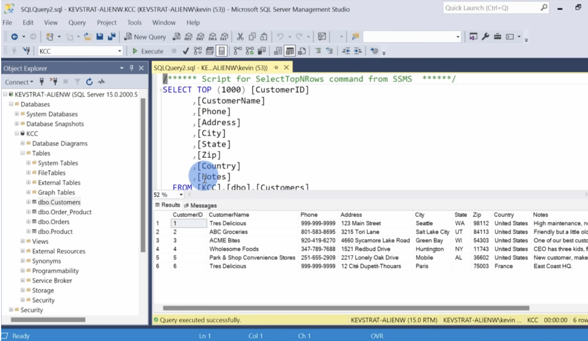

## Table Components
The results section of a database query is structured like a regular data table:
* **Fields:** The columns of the table that define the categories of data.
* **Records:** The rows of the table that represent individual entries.

## Data Granularization
To query against data effectively, it must be simplified and broken down to its most granular level. For example, location data is split into distinct fields rather than being combined into a single text block:
* City
* State
* Country
* Zip Code

Breaking data down this way makes it much easier to filter, sort, and query.

## Connecting Tables
Databases store information across multiple separate tables. A connection can be established between any two tables whenever they share **something in common** (such as a matching ID or key field).

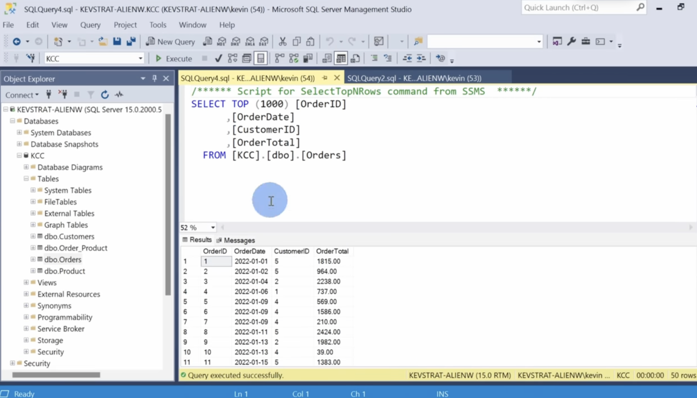

- Both the tables have ‘Customer ID’ in common. Hence both the tables are related with the help of ‘Customer ID’.
- Customer ID in the first table (customer table) also happens to be the primary key. Primary key is the minimum number of columns you need to uniquely identify a record. It helps us to uniquely identify a row or a column (records). In the second table (order table), the unique identifier is the Order ID hence it is the primary key. 
- Database diagram is also present. We can also create our own database diagram.

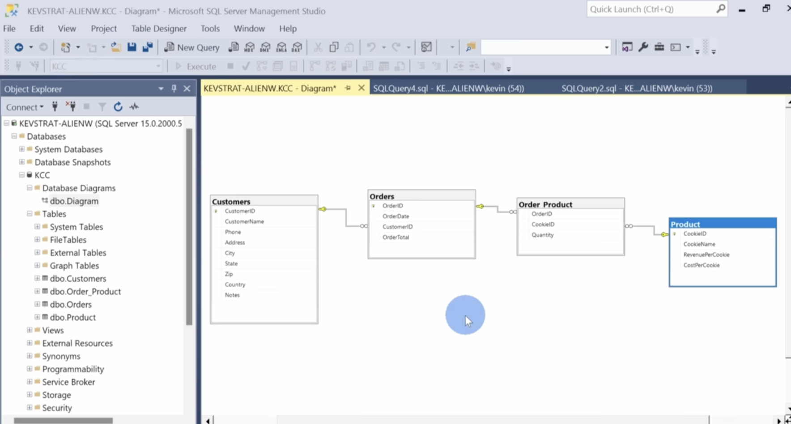


- Database diagram shows the databases which are present along with their fields. The small yellow in each database is the primary key (unique identifier) in each database. 
- In the order product table, there is no individual primary key. In that table to uniquely identify an item it is the Order ID and the cookie ID. 
- For many different customers, there can be many orders. Hence outside the table there is an infinity sign indicating one to many relationships. Similarly, for each orders there are many order products. Lastly, for one product there can be many order products as well. 
- We can also get an idea of the data type of each table. During querying, it becomes easier.


# QUERY

1. We want see all the list of customers. When we look at the customer database, there is one called ‘customerName’.

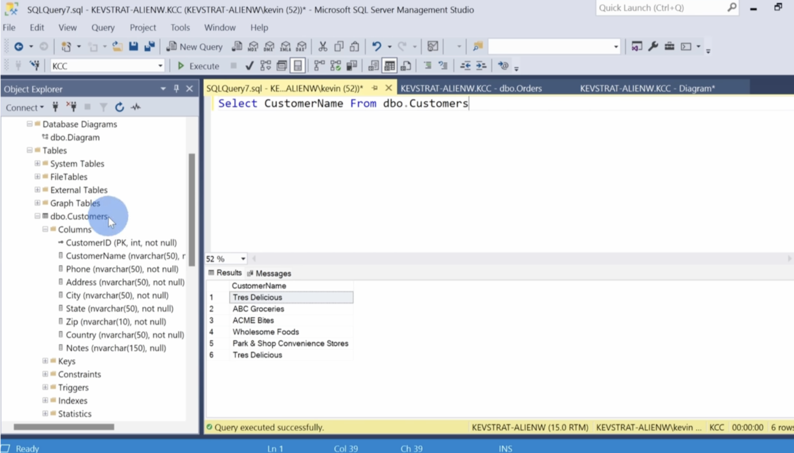

1. **Start with SELECT:** The `SELECT` command allows us to retrieve data from a table. 
2. **Specify the column:** Type `CustomerName` exactly as it is mentioned in the database schema.
3. **Indicate the source:** Next, we need to mention where we want to get the customer name from—hence, type `FROM`. 
4. **Name the table:** It is obtained from the `dbo.Customers` database, so type `dbo.Customers`.
5. **Run the query:** Click on **Execute** to see your results.

#### 💻 Complete Query Example
```sql
SELECT CustomerName 
FROM dbo.Customers;
```

2. To include the specific notes associated with each customer in your current reporting or database query, update your existing selection block to append the `Notes` field. 

### Implementation
Keep the rest of your original query structure exactly the same, and modify your target fields list as shown below:


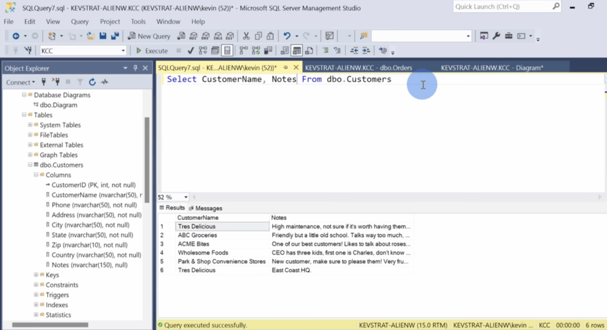

```sql
/* Update your SELECT statement by appending the notes column */
SELECT CustomerID, CustomerName, ContactEmail, Notes
FROM Customers;
```

* **Adjustment:** Just add `Notes` with a comma following your preceding field. 
* **Consistency:** The remaining filters, joins, and sorting parameters of the query do not need to change.

3. ## Working with Multiple Databases
* **Simultaneous Connections:** SQL environments allow you to connect to and work with multiple databases at the same time.
* **Context Selection:** The active database context is typically visible in the connection settings (e.g., a dropdown menu located at the top-left of the application interface showing a specific database like `KCC`).

## Preventing Context Failures (The Master Database Issue)
* **Execution Errors:** If your current session context is set to a system database like `master`, executing a query against local tables (e.g., `dbo.customers`) will fail. 
* **Cause:** The table `dbo.customers` does not exist inside the system `master` schema.

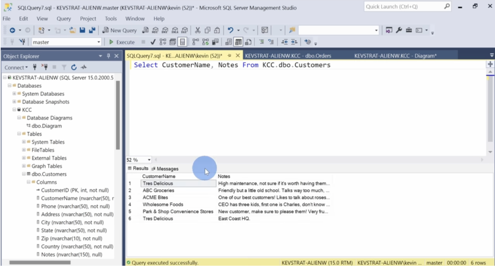

## Multi-Database Referencing Solution
* **Explicit Naming:** You can query tables outside your active database context by using a fully qualified domain reference.
* **Syntax Pattern:** Prepend the target database name directly before the schema and table name using standard dot notation.
* **Implementation Example:** Change your standard table call to a fully qualified target reference:
  ```sql
  -- Standard query (fails if active context is not 'KCC')
  SELECT * FROM dbo.customers;

  -- Fully qualified query (succeeds regardless of active context)
  SELECT * FROM KCC.dbo.customers;
  ```


4. ## The Formatting Challenge
When querying columns from a relational database, column identifiers frequently use formatting variants like PascalCase (e.g., `CustomerName`) or underscores to maintain backend naming standards. However, these raw identifiers often lack user-friendly formatting when displayed directly on reporting dashboards or customer-facing outputs.

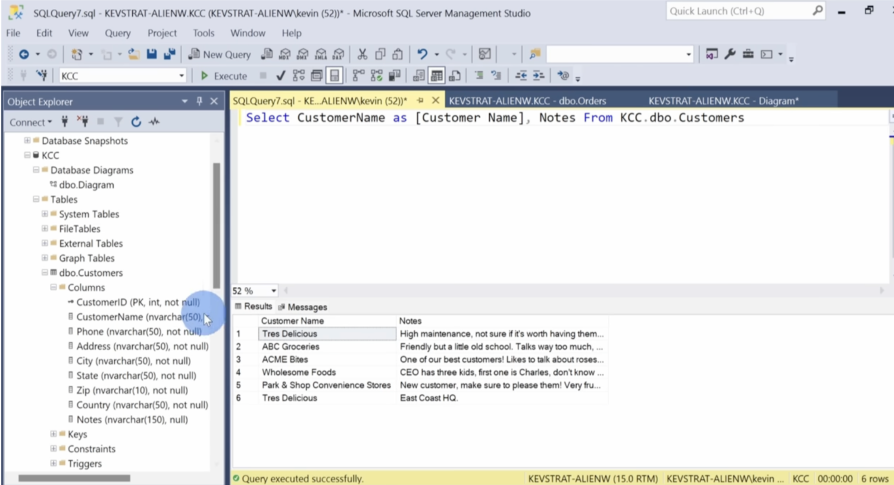

## The Solution: Column Aliasing
To insert a blank space or create a readable name for a column header, utilize the **`AS` keyword** followed by an identifier enclosed in square brackets (`[...]`). 

### Key Syntax Rules
* **The `AS` Keyword:** Appended immediately after the target database column name to indicate a temporary rename in the output.
* **Square Brackets (`[]`):** Function as explicit delimiters in relational database dialects (such as SQL Server). They instruct the query engine to interpret any characters enclosed within them—including whitespace—as a single literal string identifier rather than system keywords or separate syntax commands.
* **Flexibility:** Any custom title can be added inside the brackets to meet your specific structural presentation or business requirements.

### Implementation Comparison

| Before Aliasing | After Aliasing |
| :--- | :--- |
| Returns standard unspaced table header. | Returns structured column header with spaces. |
| `SELECT CustomerName FROM dbo.customers;` | `SELECT CustomerName AS [Customer Name] FROM dbo.customers;` |


5. # SQL: Obtaining Distinct and Unique Records

## The Problem: Duplicate Rows in Query Results
When querying tables with repeated data—such as a customer list where a company like **Tres Delicious** appears multiple times because it has different headquarters or branch offices—a standard `SELECT` statement returns every matching row. This leads to duplicate entries in your final result set.

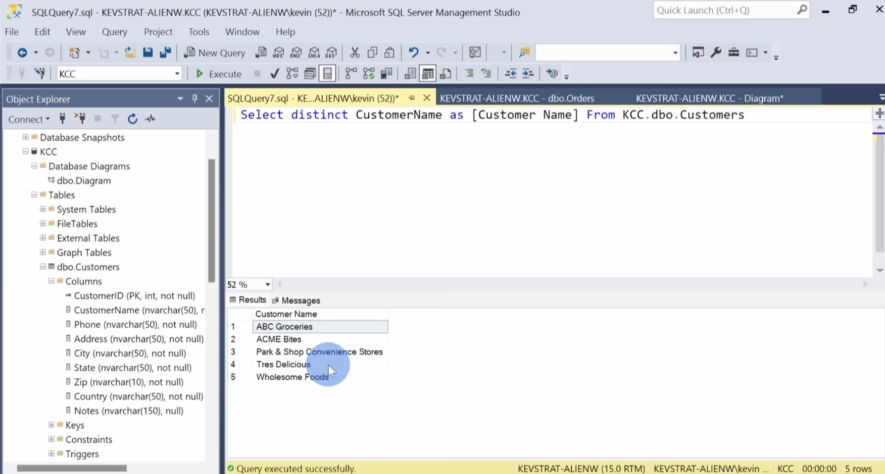

## The Solution: The `DISTINCT` Keyword
To filter out duplicate rows and return only unique values, insert the **`DISTINCT`** keyword immediately after the `SELECT` command.

### Syntax Implementation
```sql
SELECT DISTINCT CustomerName
FROM KCC.dbo.customers;
```

### How It Works
1. **Scans the Columns:** The database engine evaluates the combination of columns specified after the `DISTINCT` keyword.
2. **Eliminates Redundancy:** If a value like *Tres Delicious* occurs more than once in the target column, the engine removes the duplicates from the output display.
3. **Consolidated Output:** The final result list displays each unique customer name exactly **once**, regardless of how many times it exists inside the underlying database table.

6. ## 6. Retrieving All Columns in SQL

To retrieve all columns and records from a specific table in a database, use the **`SELECT *`** statement. The asterisk (`*`) acts as a wildcard that tells the database engine to return every column available in that table.

### Basic Syntax
```sql
SELECT * FROM table_name;
```

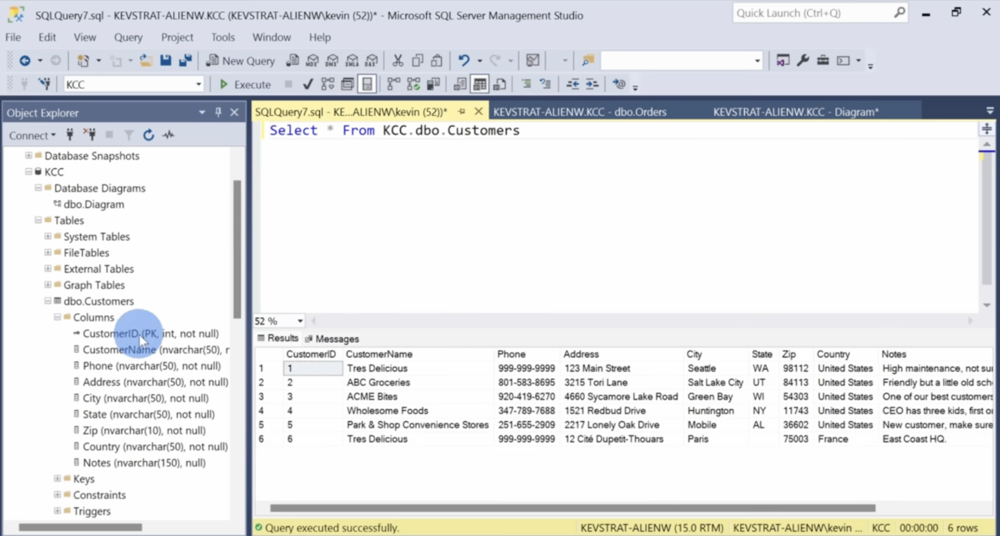

### How It Works

* **`SELECT`**: The primary clause used to query data from a database.
* **`*`**: The wildcard character specifying that **all columns** should be included in the results.
* **`FROM table_name`**: Specifies the exact table where the data is located.

## 7.  Retrieving Top 3 Columns in SQL

### Basic Syntax
```sql
SELECT top(3) * FROM table_name;
```

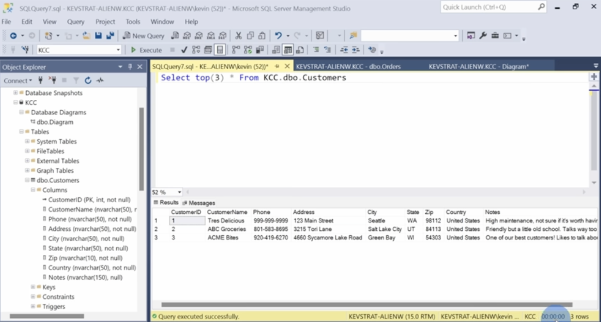


## 8. Filtering with WHERE

To retrieve the list of customers in the state of WA
### Basic Syntax
```sql
SELECT * FROM table_name 
where State = 'WA';
```

* Feel free to insert spaces to make it look cleaner and better.
* Entering comments also help with the help of **`--`** or **`/*`**

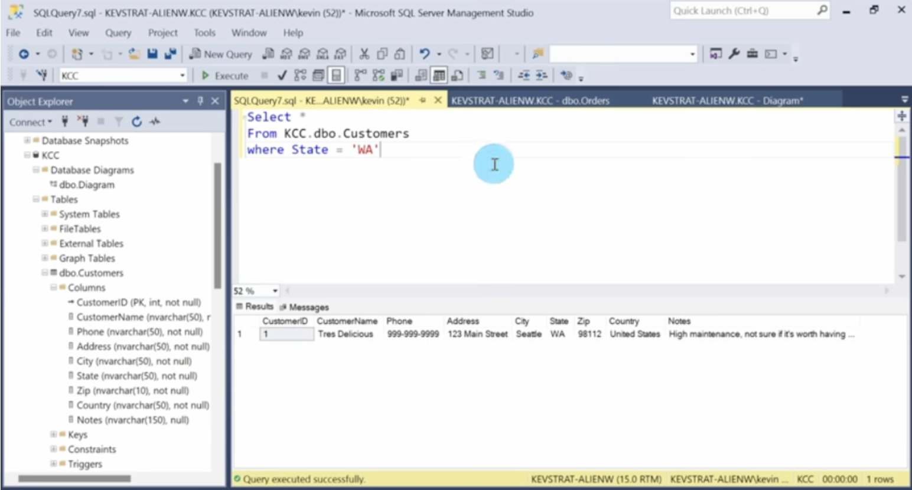

In the above example, we filtered data equal to `WA` state. 
We can also filter data `not equal` to WA state using `!=` or `<>`

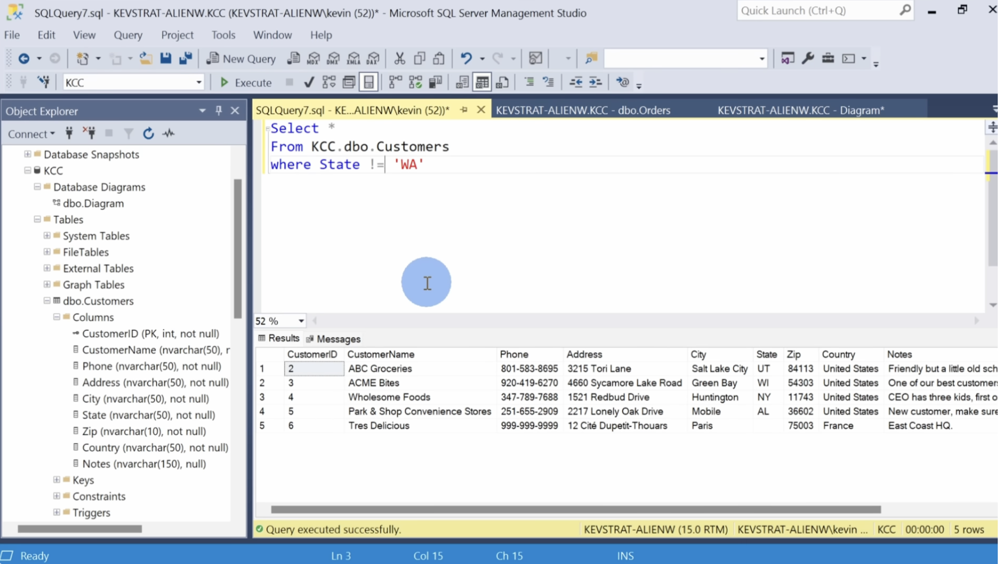


## 9. Using OR statement

We can also filter the data with multiple states. For e.g. if we want two states, we use `OR`

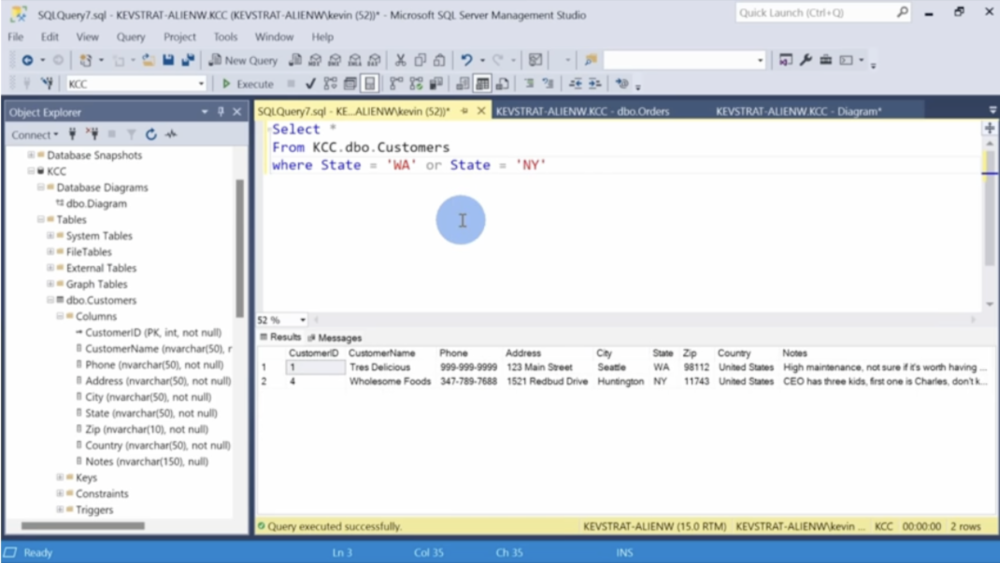


## 10. Using IN and NOT IN

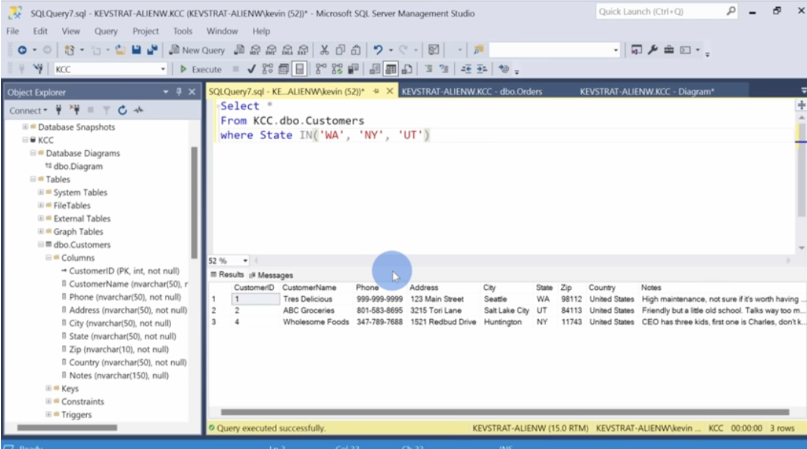

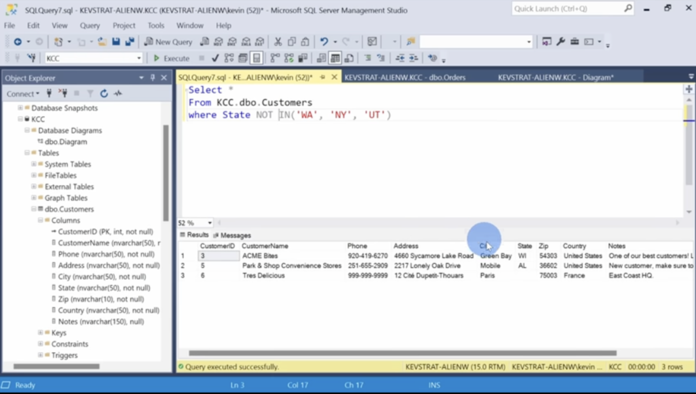


## 11. Using AND

We can type a query where we specifically want a customer with a specific country. For that we type `AND`

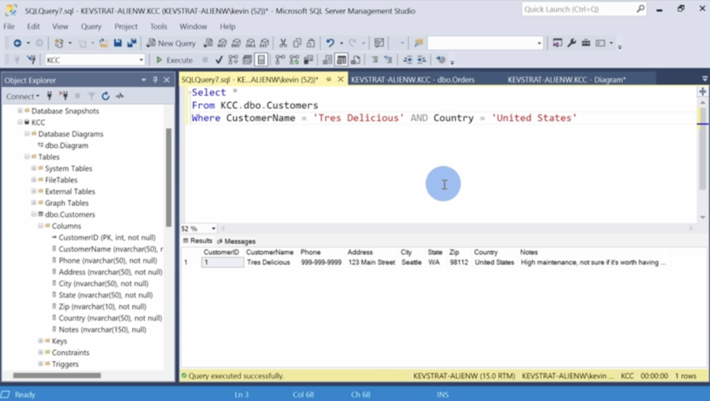


