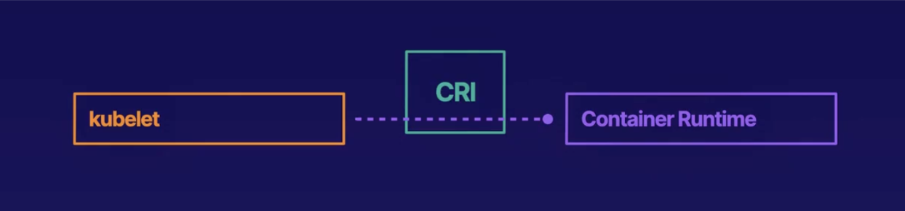

# Introduction

**Cloud-Native** is everything that is built on the cloud. A cloud-native application means the application is fully deployed on the cloud.

**Kubernetes** (also known as **K8s**) is an open-source system for automating the deployment, scaling, and management of containerized applications. 
* It is a cloud-native platform for containerized applications.
* It enables you to manage containerized applications with cloud-native features.
* It works in both public and private clouds.

### Key Tools
* **`kubeadm`**: A tool that simplifies the process of setting up a Kubernetes cluster.
* **Calico**: Used to set up Kubernetes networking.

---

# Kubernetes Resources

**Resources** are objects of a certain type in the Kubernetes API (Application Program Interface). We interact with the cluster by creating and modifying these objects. Anything created by the Kubernetes API is a resource.

### Pods
* **Pod**: The most basic resource in Kubernetes.
* It represents a group of one or more containers.
* The application runs inside the pod.

### Resource Types
Objects and resources have a specific resource type. **Pods**, **Deployments**, and **Services** are all different resource types. 
* Each resource type specifies different functionality in Kubernetes.
* Each individual pod is an object.

### Configuration & Deployment
You can create a Kubernetes configuration file to define a resource type (e.g., `my-pod.yml`, where you define a `pod` resource type).

* `kubectl apply -f my-pod.yml` — This command will apply the configuration defined in the Kubernetes cluster.
* `kubectl get pods` — This command will show the pods that are spun up. This creates a pod object.

---

# Resources for Managing Pods

Kubernetes has a variety of resource types dedicated to **pod management**:

* **ReplicaSet**: It ensures that a given number of pod replicas are running at any specified time. Pod creation is done with the help of a template, and pods can also be destroyed through it.
* **Deployment**: It can be used for scaling applications by declaring the minimum and maximum replicas. It uses a `RollingUpdate` deployment strategy for zero-downtime updates to the workload. This means that when a deployment is updated, the new pods replace the older ones one by one, rather than all at once. Deployment is used to manage stateless applications (Applications are running inside a pod. This pod has a specific configuration maintained. For a stateful application, the pod inside which this application is running has a configuration maintained and if this pod fails, the new pod that is spun up has the same configuration as the previous pod. But for stateless application, the pod configuration is not maintained hence if this pod is gone and if another pod needs to spin up, that new pod will not have a similar configuration as the old one). Deployment automatically creates replica set. 

# Kubernetes Resource Management & Architecture

## Pod Verification Commands
```bash
# Get all active deployments in the namespace
kubectl get deployment

# Get all replica sets to see pod scaling status
kubectl get replicaset

# Get all pods to see individual running instances
kubectl get pods
```

---

## Workload Resources

* **StatefulSet**: Used for managing stateful applications. It maintains a sticky identity and strict ordering for each pod (keeping the same pod name and network hostname) even if they are re-created on a different node. While a **Deployment** creates random pod names upon re-creation, a **StatefulSet** guarantees the new pod keeps the exact same name and sequence order. A **Headless Service** must be created alongside a StatefulSet to manage its network identity.
* **DaemonSet**: Ensures that a replica copy of a specific pod runs on every node in the cluster. It dynamically provisions replicas on new nodes as they join the cluster. Filter criteria (such as node selectors or affinities) can be applied to restrict execution to specific subsets of nodes.
* **Job**: Reliably executes a discrete, containerised task to its successful completion.
* **CronJob**: Runs jobs repeatedly according to a specified temporal schedule (e.g., executing a routine application task inside a pod every minute).

---

## Kubernetes Architecture

* **Data Plane / Nodes**: The underlying worker machines that host pods and actively run container workloads.
* **Control Plane**: The orchestration layer consisting of a collection of core components that manage node states, pod scheduling, and the overall cluster lifecycle.


* **API Server**: The center of the control plane. Other users and components use the API server to communicate and interact with the cluster.
* **etcd**: Consistent and highly-available key-value store used by the API server to store data about the state of the cluster. It stores object data when objects are created with the help of the kube API server.
* **Scheduler**: Watches for new Pods that have not yet been assigned to any Node and selects an appropriate Node to run each new Pod. This process is called scheduling.
* **Controller Manager**: Combines multiple controllers into a single process. Each controller provides different functionality to the cluster.
* **Cloud Controller Manager**: Runs controllers that interact with cloud provider APIs and features.

### Node Components (Data Plane)
* **kube-proxy**: Maintains network rules on Nodes to route traffic to Pods.
* **kubelet**: An agent that runs on each node in the cluster. It ensures containers in each pod are running.
* **Container Runtime**: The software responsible for running containers, such as `containerd`.

---

## Kubernetes API
The Kubernetes API allows communication between Kubernetes objects, as well as between objects and users.

* **HTTP/RESTful Interface**: It is an HTTP API that allows users, cluster components, and external components to communicate. We interact with this API to modify our Kubernetes objects, which determine the functionality of the cluster. All API requests and responses are recorded.
* **State Retrieval**: Allows you to query the state of Kubernetes objects like Pods. You can retrieve a representation of the state of a resource or an object.
* **State Declaration**: You can send a representation of the desired state to create or update objects.
* **Persistence**: Refers to the permanent storage of data. `etcd` acts as the persistent storage that stores the state of all objects. The HTTP API can be used to retrieve any of this data.
* **Standard Operations**: Interact with the state of objects via HTTP methods like `GET`, `POST`, `PUT`, `PATCH`, etc.
* **Design Alternative**: If an application is a best-effort service (where successful/unsuccessful responses do not matter), you might design APIs that are not RESTful to reduce costs, increase speed, and maintain less overhead.

---

## Containers
* **Definition**: A self-contained package containing code and all of its dependencies.
* **Isolation**: Can run with specialized isolation from other processes on the host machine.
* **Dockerfile**: A text file containing commands and instructions used to build container images.
* **Granularity**: A container is typically a single process, while a Pod can contain multiple containers.

---

## Scheduling
Scheduling is the process of assigning a new Pod to a Node. The scheduler takes a variety of factors into account when choosing a Node.

* **Trigger**: The scheduler looks for Pods that are not yet scheduled. When a new Pod is created and lacks a node assignment, scheduling is triggered.
* **Decision Factors**:
  * **Resource requirements**: Assigns Pods only to Nodes with sufficient resources (CPU, Memory).
  * **Pod affinity and anti-affinity**: Rules that pull pods together or keep them apart.
  * **Taints and tolerations**: Taints prevent Pods from scheduling on Nodes by default unless the Pods provide corresponding tolerations.

---

## Container Orchestration
Container Orchestration is the automation of the work required to run and manage containerized workloads.

* **The Problem**: If we manage containers manually, we must perform tasks like deploying, running, and restarting containers by hand. This is like playing several musical instruments at one time.
* **The Solution**: Orchestration automates all of these tasks. We just give commands to the orchestration tool, and it handles the execution. It is like conducting an orchestra by providing general direction.
* **Kubernetes as an Orchestrator**: 
  * The **Kubernetes Scheduler** helps deploy containers by automatically assigning a Pod to a Node.
  * The **kubelet** handles spinning up the containers on that assigned Node.
  * The **kubelet** also assists in restarting broken containers automatically when they become unhealthy. 
  * **Liveness Probes** allow you to customize exactly how the kubelet detects a container's health status.


## 1. Container Runtime
The **Container Runtime** is a piece of software responsible for running containers. It is **not** part of core Kubernetes and must be installed separately. 



* **Communication Mechanism:** The `kubelet` communicates directly with the container runtime.
* **The CRI Standard:** To support multiple runtimes, Kubernetes uses the **Container Runtime Interface (CRI)**, a standard protocol that allows different runtime engines to plug into the cluster seamlessly.

### Common Container Runtimes
* **`containerd`**: A Cloud Native Computing Foundation (CNCF) project emphasizing simplicity, robustness, and portability.
* **CRI-O**: A lightweight alternative to Docker built explicitly to provide CRI compatibility for `runc` and Kata containers.

---

## 2. Kubernetes Security Model

Kubernetes security follows the **4 Cs of Cloud-Native Security**: **Cloud**, **Cluster**, **Container**, and **Code**.

| Security Layer | User Control | Responsibility Focus |
| :--- | :--- | :--- |
| **Cloud** | Lowest Control | Underlying infrastructure, physical security, and cloud provider APIs. |
| **Cluster** | Medium Control | API server protection, network policies, and cluster configuration. |
| **Container** | High Control | Base image hardening, vulnerability scanning, and runtime security. |
| **Code** | Highest Control | Application logic, secure coding practices, and dependency scanning. |

### Authentication vs. Authorization
* **Authentication (AuthN):** Verifies *who* the client is. Methods include client certificates, bearer tokens, OpenID Connect (OIDC) tokens, authenticating proxies, and anonymous authentication.
* **Authorization (AuthZ):** Determines *what* an authenticated user has permission to do.

### Authorization Methods
* **Role-Based Access Control (RBAC):** Assigns granular permissions to roles, which are then assigned to users or service accounts. This is the most common and critical method.
* **Node Authorization:** A special use case granting specific permissions needed by a `kubelet` to interact with resources on its own node.
* **Attribute-Based Access Control (ABAC):** Defines permissions using policies that check user and resource attributes.
* **Webhook Authorization:** Configures the API server to query an external HTTP service to determine if an action is allowed.

### Policy Enforcement with OPA Gatekeeper
**OPA Gatekeeper** is a generalized tool existing outside the Kubernetes cluster that allows administrators to create and enforce custom policies.
* It intercepts incoming admission requests to the API server.
* It validates requests against user-defined rules.
* If a request violates a policy, the API server denies it immediately.

---

## 3. Kubernetes Networking

### The Cluster Network
Kubernetes provides a **flat virtual network** that allows seamless, transparent communication between pods across the entire cluster.
* **Unique IPs:** Every pod receives a unique IP address within the cluster network.
* **Transparent Communication:** Pods talk directly using IP addresses without needing to know whether they reside on the same node or different physical/virtual nodes.
* **Verification Example:** A client pod can reach a server pod across different nodes simply by routing a `curl` request directly to the server pod's IP address.

### ClusterDNS
The cluster includes a built-in Domain Name Server (**ClusterDNS**).
* It automatically allows containers to discover other services inside the cluster using simple hostnames.
* All Kubernetes containers are automatically pre-configured to resolve names via the ClusterDNS server.

### Network Policies
By default, pods are **non-isolated**, meaning they accept traffic from any source. A **Network Policy** is a configuration object used to restrict this traffic.
* **Isolation:** Once a Network Policy selects a pod, that pod becomes **isolated** (locked down). It will only accept traffic explicitly permitted by the policy rules.
* **Separation of Traffic:** Incoming (**ingress**) and outgoing (**egress**) traffic rules are configured and treated independently.

---

## 4. Deep Dive into Services

A **Service** acts as a stable abstraction layer to expose applications running on a dynamic, ephemeral set of replica pods. Clients connect directly to the service, which acts as a proxy to forward traffic to the appropriate backend pods.

### Service Types

* **`ClusterIP` (Default):** Exposes the service on a stable internal IP address within the cluster network. It is used strictly for internal communication between workloads inside the same cluster.
* **`NodePort`:** Exposes the service externally by opening a specific port on every node's physical IP address. This allows external clients outside the cluster to access internal workloads.
* **`LoadBalancer`:** Exposes the service externally using a cloud provider's managed load balancer (e.g., AWS Elastic Kubernetes Service / EKS). It automatically spins up the infrastructure needed to direct external internet traffic into the cluster.
* **`ExternalName`:** Maps a service to a DNS record pointing to an external endpoint outside the cluster. For example, if `Pod A` needs to reach an external `Pod B` in a separate cluster, it requests the hostname, and the `ExternalName` service maps it directly to the target external IP.
* **`Headless Service`:** A service created explicitly without a `ClusterIP`. It interfaces directly with service discovery mechanisms to return backend pod IPs without proxying traffic.
* **Selectorless Services:** A service created without a label selector. Traffic is not routed automatically; administrators must manually configure custom `Endpoints` or `EndpointSlices` objects to direct traffic.

### Service Discovery
Kubernetes provides two primary strategies for locating and connecting to services:
1. **ClusterDNS:** Resolving services natively using their internal registered hostnames.
2. **Environment Variables:** The `kubelet` automatically injects environment variables containing service name, IP, and port information into every container upon startup.
