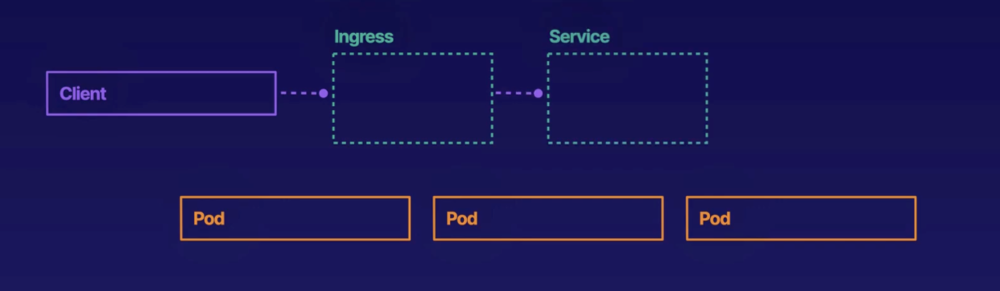
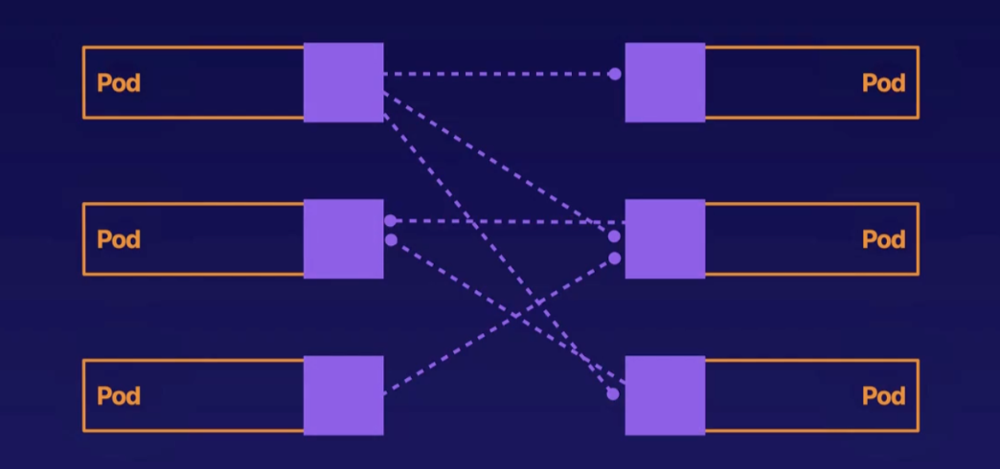
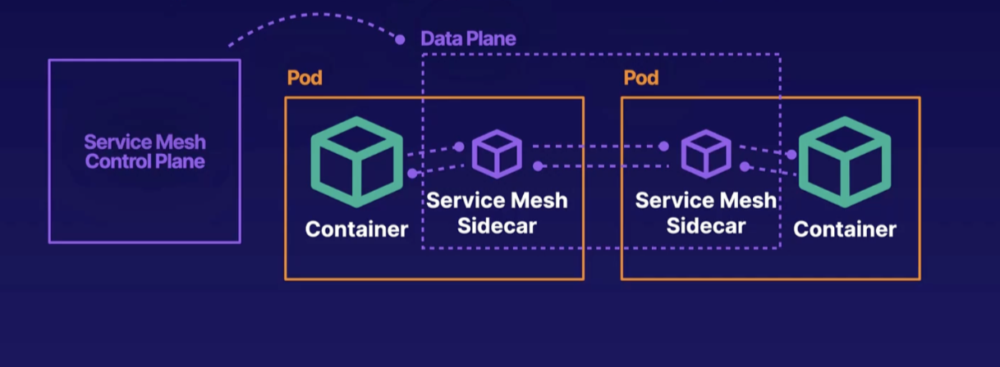
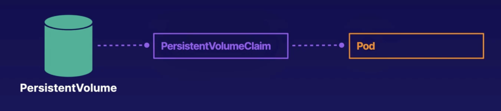
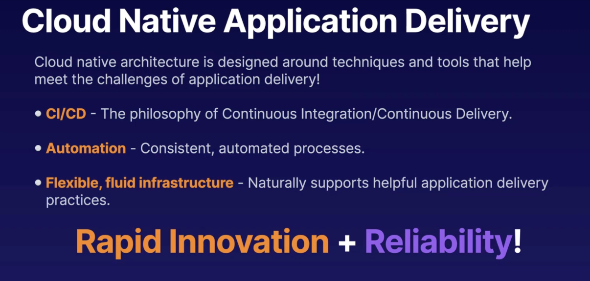

# Introduction

**Cloud-Native** is everything that is built on the cloud. A cloud-native application means the application is fully deployed on the cloud.

**Kubernetes** (also known as **K8s**) is an open-source system for automating the deployment, scaling, and management of containerized applications. 
* It is a cloud-native platform for containerized applications.
* It enables you to manage containerized applications with cloud-native features.
* It works in both public and private clouds.

### Key Tools
* **`kubeadm`**: A tool that simplifies the process of setting up a Kubernetes cluster.
* **Calico**: Used to set up Kubernetes networking.

---

# Kubernetes Resources

**Resources** are objects of a certain type in the Kubernetes API (Application Program Interface). We interact with the cluster by creating and modifying these objects. Anything created by the Kubernetes API is a resource.

### Pods
* **Pod**: The most basic resource in Kubernetes.
* It represents a group of one or more containers.
* The application runs inside the pod.

### Resource Types
Objects and resources have a specific resource type. **Pods**, **Deployments**, and **Services** are all different resource types. 
* Each resource type specifies different functionality in Kubernetes.
* Each individual pod is an object.

### Configuration & Deployment
You can create a Kubernetes configuration file to define a resource type (e.g., `my-pod.yml`, where you define a `pod` resource type).

* `kubectl apply -f my-pod.yml` — This command will apply the configuration defined in the Kubernetes cluster.
* `kubectl get pods` — This command will show the pods that are spun up. This creates a pod object.

---

# Resources for Managing Pods

Kubernetes has a variety of resource types dedicated to **pod management**:

* **ReplicaSet**: It ensures that a given number of pod replicas are running at any specified time. Pod creation is done with the help of a template, and pods can also be destroyed through it.
* **Deployment**: It can be used for scaling applications by declaring the minimum and maximum replicas. It uses a `RollingUpdate` deployment strategy for zero-downtime updates to the workload. This means that when a deployment is updated, the new pods replace the older ones one by one, rather than all at once. Deployment is used to manage stateless applications (Applications are running inside a pod. This pod has a specific configuration maintained. For a stateful application, the pod inside which this application is running has a configuration maintained and if this pod fails, the new pod that is spun up has the same configuration as the previous pod. But for stateless application, the pod configuration is not maintained hence if this pod is gone and if another pod needs to spin up, that new pod will not have a similar configuration as the old one). Deployment automatically creates replica set. 

# Kubernetes Resource Management & Architecture

## Pod Verification Commands
```bash
# Get all active deployments in the namespace
kubectl get deployment

# Get all replica sets to see pod scaling status
kubectl get replicaset

# Get all pods to see individual running instances
kubectl get pods
```

---

## Workload Resources

* **StatefulSet**: Used for managing stateful applications. It maintains a sticky identity and strict ordering for each pod (keeping the same pod name and network hostname) even if they are re-created on a different node. While a **Deployment** creates random pod names upon re-creation, a **StatefulSet** guarantees the new pod keeps the exact same name and sequence order. A **Headless Service** must be created alongside a StatefulSet to manage its network identity.
* **DaemonSet**: Ensures that a replica copy of a specific pod runs on every node in the cluster. It dynamically provisions replicas on new nodes as they join the cluster. Filter criteria (such as node selectors or affinities) can be applied to restrict execution to specific subsets of nodes.
* **Job**: Reliably executes a discrete, containerised task to its successful completion.
* **CronJob**: Runs jobs repeatedly according to a specified temporal schedule (e.g., executing a routine application task inside a pod every minute).

---

## Kubernetes Architecture

* **Data Plane / Nodes**: The underlying worker machines that host pods and actively run container workloads.
* **Control Plane**: The orchestration layer consisting of a collection of core components that manage node states, pod scheduling, and the overall cluster lifecycle.


* **API Server**: The center of the control plane. Other users and components use the API server to communicate and interact with the cluster.
* **etcd**: Consistent and highly-available key-value store used by the API server to store data about the state of the cluster. It stores object data when objects are created with the help of the kube API server.
* **Scheduler**: Watches for new Pods that have not yet been assigned to any Node and selects an appropriate Node to run each new Pod. This process is called scheduling.
* **Controller Manager**: Combines multiple controllers into a single process. Each controller provides different functionality to the cluster.
* **Cloud Controller Manager**: Runs controllers that interact with cloud provider APIs and features.

### Node Components (Data Plane)
* **kube-proxy**: Maintains network rules on Nodes to route traffic to Pods.
* **kubelet**: An agent that runs on each node in the cluster. It ensures containers in each pod are running.
* **Container Runtime**: The software responsible for running containers, such as `containerd`.

---

## Kubernetes API
The Kubernetes API allows communication between Kubernetes objects, as well as between objects and users.

* **HTTP/RESTful Interface**: It is an HTTP API that allows users, cluster components, and external components to communicate. We interact with this API to modify our Kubernetes objects, which determine the functionality of the cluster. All API requests and responses are recorded.
* **State Retrieval**: Allows you to query the state of Kubernetes objects like Pods. You can retrieve a representation of the state of a resource or an object.
* **State Declaration**: You can send a representation of the desired state to create or update objects.
* **Persistence**: Refers to the permanent storage of data. `etcd` acts as the persistent storage that stores the state of all objects. The HTTP API can be used to retrieve any of this data.
* **Standard Operations**: Interact with the state of objects via HTTP methods like `GET`, `POST`, `PUT`, `PATCH`, etc.
* **Design Alternative**: If an application is a best-effort service (where successful/unsuccessful responses do not matter), you might design APIs that are not RESTful to reduce costs, increase speed, and maintain less overhead.

---

## Containers
* **Definition**: A self-contained package containing code and all of its dependencies.
* **Isolation**: Can run with specialized isolation from other processes on the host machine.
* **Dockerfile**: A text file containing commands and instructions used to build container images.
* **Granularity**: A container is typically a single process, while a Pod can contain multiple containers.

---

## Scheduling
Scheduling is the process of assigning a new Pod to a Node. The scheduler takes a variety of factors into account when choosing a Node.

* **Trigger**: The scheduler looks for Pods that are not yet scheduled. When a new Pod is created and lacks a node assignment, scheduling is triggered.
* **Decision Factors**:
  * **Resource requirements**: Assigns Pods only to Nodes with sufficient resources (CPU, Memory).
  * **Pod affinity and anti-affinity**: Rules that pull pods together or keep them apart.
  * **Taints and tolerations**: Taints prevent Pods from scheduling on Nodes by default unless the Pods provide corresponding tolerations.

---

## Container Orchestration
Container Orchestration is the automation of the work required to run and manage containerized workloads.

* **The Problem**: If we manage containers manually, we must perform tasks like deploying, running, and restarting containers by hand. This is like playing several musical instruments at one time.
* **The Solution**: Orchestration automates all of these tasks. We just give commands to the orchestration tool, and it handles the execution. It is like conducting an orchestra by providing general direction.
* **Kubernetes as an Orchestrator**: 
  * The **Kubernetes Scheduler** helps deploy containers by automatically assigning a Pod to a Node.
  * The **kubelet** handles spinning up the containers on that assigned Node.
  * The **kubelet** also assists in restarting broken containers automatically when they become unhealthy. 
  * **Liveness Probes** allow you to customize exactly how the kubelet detects a container's health status.


## 1. Container Runtime
The **Container Runtime** is a piece of software responsible for running containers. It is **not** part of core Kubernetes and must be installed separately. 


* **Communication Mechanism:** The `kubelet` communicates directly with the container runtime.
* **The CRI Standard:** To support multiple runtimes, Kubernetes uses the **Container Runtime Interface (CRI)**, a standard protocol that allows different runtime engines to plug into the cluster seamlessly.

### Common Container Runtimes
* **`containerd`**: A Cloud Native Computing Foundation (CNCF) project emphasizing simplicity, robustness, and portability.
* **CRI-O**: A lightweight alternative to Docker built explicitly to provide CRI compatibility for `runc` and Kata containers.

---

## 2. Kubernetes Security Model

Kubernetes security follows the **4 Cs of Cloud-Native Security**: **Cloud**, **Cluster**, **Container**, and **Code**.

| Security Layer | User Control | Responsibility Focus |
| :--- | :--- | :--- |
| **Cloud** | Lowest Control | Underlying infrastructure, physical security, and cloud provider APIs. |
| **Cluster** | Medium Control | API server protection, network policies, and cluster configuration. |
| **Container** | High Control | Base image hardening, vulnerability scanning, and runtime security. |
| **Code** | Highest Control | Application logic, secure coding practices, and dependency scanning. |

### Authentication vs. Authorization
* **Authentication (AuthN):** Verifies *who* the client is. Methods include client certificates, bearer tokens, OpenID Connect (OIDC) tokens, authenticating proxies, and anonymous authentication.
* **Authorization (AuthZ):** Determines *what* an authenticated user has permission to do.

### Authorization Methods
* **Role-Based Access Control (RBAC):** Assigns granular permissions to roles, which are then assigned to users or service accounts. This is the most common and critical method.
* **Node Authorization:** A special use case granting specific permissions needed by a `kubelet` to interact with resources on its own node.
* **Attribute-Based Access Control (ABAC):** Defines permissions using policies that check user and resource attributes.
* **Webhook Authorization:** Configures the API server to query an external HTTP service to determine if an action is allowed.

### Policy Enforcement with OPA Gatekeeper
**OPA Gatekeeper** is a generalized tool existing outside the Kubernetes cluster that allows administrators to create and enforce custom policies.
* It intercepts incoming admission requests to the API server.
* It validates requests against user-defined rules.
* If a request violates a policy, the API server denies it immediately.

---

## 3. Kubernetes Networking

### The Cluster Network
Kubernetes provides a **flat virtual network** that allows seamless, transparent communication between pods across the entire cluster.
* **Unique IPs:** Every pod receives a unique IP address within the cluster network.
* **Transparent Communication:** Pods talk directly using IP addresses without needing to know whether they reside on the same node or different physical/virtual nodes.
* **Verification Example:** A client pod can reach a server pod across different nodes simply by routing a `curl` request directly to the server pod's IP address.

### ClusterDNS
The cluster includes a built-in Domain Name Server (**ClusterDNS**).
* It automatically allows containers to discover other services inside the cluster using simple hostnames.
* All Kubernetes containers are automatically pre-configured to resolve names via the ClusterDNS server.

### Network Policies
By default, pods are **non-isolated**, meaning they accept traffic from any source. A **Network Policy** is a configuration object used to restrict this traffic.
* **Isolation:** Once a Network Policy selects a pod, that pod becomes **isolated** (locked down). It will only accept traffic explicitly permitted by the policy rules.
* **Separation of Traffic:** Incoming (**ingress**) and outgoing (**egress**) traffic rules are configured and treated independently.

---

## 4. Deep Dive into Services

A **Service** acts as a stable abstraction layer to expose applications running on a dynamic, ephemeral set of replica pods. Clients connect directly to the service, which acts as a proxy to forward traffic to the appropriate backend pods.

### Service Types

* **`ClusterIP` (Default):** Exposes the service on a stable internal IP address within the cluster network. It is used strictly for internal communication between workloads inside the same cluster.
* **`NodePort`:** Exposes the service externally by opening a specific port on every node's physical IP address. This allows external clients outside the cluster to access internal workloads.
* **`LoadBalancer`:** Exposes the service externally using a cloud provider's managed load balancer (e.g., AWS Elastic Kubernetes Service / EKS). It automatically spins up the infrastructure needed to direct external internet traffic into the cluster.
* **`ExternalName`:** Maps a service to a DNS record pointing to an external endpoint outside the cluster. For example, if `Pod A` needs to reach an external `Pod B` in a separate cluster, it requests the hostname, and the `ExternalName` service maps it directly to the target external IP.
* **`Headless Service`:** A service created explicitly without a `ClusterIP`. It interfaces directly with service discovery mechanisms to return backend pod IPs without proxying traffic.
* **Selectorless Services:** A service created without a label selector. Traffic is not routed automatically; administrators must manually configure custom `Endpoints` or `EndpointSlices` objects to direct traffic.

### Service Discovery
Kubernetes provides two primary strategies for locating and connecting to services:
1. **ClusterDNS:** Resolving services natively using their internal registered hostnames.
2. **Environment Variables:** The `kubelet` automatically injects environment variables containing service name, IP, and port information into every container upon startup.

# Kubernetes Ingress

An Ingress is a Kubernetes object that manages external access to applications within the cluster. It exposes applications externally.

## Key Features
* Can offer additional functionality like **load balancing** and **SSL termination**.
* Ingress does not replace services but works alongside them. 

## How It Works
1. Ingress will route to a service in the backend. 
2. The client communicates with the ingress.
3. Ingress communicates with the services.
4. The service will eventually tap to the pod of requirement. 

If a cluster is using multiple services, the request from the client should go to a particular service depending on the request. That decision depends on ingress. Ingress helps to select which service is getting taped to access the required application within a pod.# Kubernetes Ingress

An Ingress is a Kubernetes object that manages external access to applications within the cluster. It exposes applications externally.

## Key Features
* Can offer additional functionality like **load balancing** and **SSL termination**.
* Ingress does not replace services but works alongside them. 

## How It Works
1. Ingress will route to a service in the backend. 
2. The client communicates with the ingress.
3. Ingress communicates with the services.
4. The service will eventually tap to the pod of requirement. 

If a cluster is using multiple services, the request from the client should go to a particular service depending on the request. That decision depends on ingress. Ingress helps to select which service is getting taped to access the required application within a pod.



# Service Meshes

Service mesh manages communication between application components often adding additional functionality like encryption, logging or tracing. (Service meshes can automate the process of providing additional security, reliability and functionality around your containers.)

It is different from Kubernetes services. Although it may share some commonalities between services. 

Say that our application is running on multiple pods. These pods have a sidecar. With the help of these sidecars, pods can communicate with each other. These sidecars are called service meshes. Application components communicate with each other with the help of service mesh proxies also called as sidecars, deployed alongside each component.

```
[ Pod A ]                          [ Pod B ]
┌─────────────────────────┐        ┌─────────────────────────┐
│ ┌───────────────┐       │        │ ┌───────────────┐       │
│ │ Main Container│       │        │ │ Main Container│       │
│ └───────┬───────┘       │        │ └───────▲───────┘       │
│         │               │        │         │               │
│ ┌───────▼───────┐       │        │ ┌───────┴───────┐       │
│ │ Proxy Sidecar │───────┼────────┼>│ Proxy Sidecar │       │
│ │ (Purple Sq.)  │       │ Traffic│ │ (Purple Sq.)  │       │
│ └───────────────┘       │        │ └───────────────┘       │
└─────────────────────────┘        └─────────────────────────┘
```


Purple squares are the sidecars/proxies. Communication occurs through them. Sidecar proxies add the additional functionality provided by service mesh.  

## Service Mesh Architecture

The service mesh has two main components: 

### 1. Service Proxy / Data Plane
* **Service proxies**, also called sidecars, are present in each pod.
* They are deployed specifically in those pods that contain the application containers needing to communicate with each other.
* These represent the "purple squares" mentioned above.
* All network communication passes directly through these sidecars.
* Together, these proxies form the **Data Plane**.

### 2. Control Plane
* The **Control Plane** controls, configures, and coordinates the data plane proxies.
* This control plane is entirely separate from the main Kubernetes control plane.
* It specifically manages the service mesh itself.
* If you want to view telemetry data present in the sidecars or push configuration changes that alter their network behavior, you interact with the control plane.

> **Key Concept:** A sidecar is basically another container running along with the main container inside the same pod.



There are various examples of service meshes: Linkerd, Consul connect, Traefik mesh, Istio, Kuma. 
Service mesh interface (SMI) - SMI is that standard interface in Kubernetes. Helps to configure any SMI supporting service  mesh using custom Kubernetes resources via Kubernetes API. Basically it is a standard interface for service meshes built in Kubernetes and if we have a service mesh that supports SMI then we can configure that service mesh with Kubernetes objects. 


# Kubernetes Storage

Volume provides external storage to our Kubernetes containers to store application data. If an application is running on the container and if you store data on the container file system and if the application gets destroyed, the information is lost. But if we need something that is more persistent or if we need something to store the data outside the container file system, we use volumes. 

### Persistent Volumes
This is related to ‘Volumes’ but they allow us to treat storage as dynamically consumable, similar to how Kubernetes treats resources like memory and CPU. Volume by itself allows us to configure storage there itself within your pod specification but for persistent volume storage is configured outside your pod specification and then later it is consumed within your pod. 

Persistent volume object in Kubernetes defines a storage resource. It is defining some place where we can store data. It can be a disk, a server etc. Persistent volume represents the actual resource itself.

### Persistent Volume Claim (PVC)
It binds dynamically to Persistent volume and allows you to mount the storage resource inside a pod. Persistent volume claim defines what kind of storage I need and then mount that inside the pod and inside the container. 

> **Summary:** Persistent volume in short defines the storage resource that is available and persistent volume claim defines what kind of storage resource do I need and ties that into a pod.



### Reclaim Policies
Persistent volumes have a concept called Reclaim Policies. This policy determines what happens to the persistent volume storage resource when Persistent volume claims are deleted. There are multiple policies for that:
* **Retain:** Reclaim manually. 
* **Recycle:** Automatic reclamation via a simple data scrub. 
* **Delete:** Only works for cloud storage resources. Underlying storage resource is deleted. 

### Rook
There is a tool called Rook which is a storage orchestrator tool that integrates with Kubernetes. Rook helps us to automate storage management with self-managing, self-scaling, self-healing storage services. It is a much more advanced way of dealing with storage in Kubernetes if there are complex storage needs. 

### ConfigMaps and Secrets
Another way of Kubernetes storage is ConfigMaps and Secrets. 
* **ConfigMaps:** Store configuration data like configuration values, config files, secure credentials and pass it to the containers. 
* **Secrets:** Used to store sensitive data like passwords or API keys. Secrets data is not encrypted by default. We need to encrypt it.

# Cloud Native Architecture Fundamentals

Cloud native architecture seeks to design systems that support the goal of cloud native technology. Tools and techniques and design strategies used to facilitate the application running on cloud. 

Cloud native technology is important because it removes roadblocks to innovation, through:
* **Software agility:** We can move quickly in making changes to our software.
* **Automation:** Gives consistency in how changes are happening in our system. All changes happen in the same methodology every single time. Saves a lot of time and work. 
* **Robust, reliable systems:** Systems available when customers need them. 

---

# Autoscaling

Automatically assigning more or fewer compute resources to an application or system in response to real-time needs. 

Autoscaling has a lot of cost advantages. Scaling too low affects reliability and performance. But scaling too high affects cost as it increases. But autoscaling helps to scale more accurately at all times, achieving reliability and performance at a lower cost. 

### Two Different Types of Scaling
* **Vertical:** Adding more compute power. It essentially means adding additional CPU or memory or cluster Nodes (basically vertical scaling means adding resources to existing apps and servers).
* **Horizontal:** Adding more instances of an application (in case of Kubernetes, it means adding new replica pods) or adding new nodes to the cluster (basically means adding additional replicas of apps and servers).

### Autoscaling Tools for Kubernetes
* **Horizontal Pod Autoscaler (HPA):** This monitors resource usage of existing replicas and creates/destroys replicas when needed. 
* **Cluster Autoscaler:** This adds and removes Nodes from cluster based upon real-time usage. 

---

# Serverless

It is a technology where developers build and run applications without worrying at all about servers and server-related concerns like servers, scaling, operating systems, etc. 

Developers only need to worry about creating their code, ship the code and the code just runs. They don’t need to worry about servers. This is the meaning of serverless. 

* **Serverless does NOT mean no servers:** Of course there are servers present and ultimately one needs to have hardware to run the code. 
* **Management:** Servers are managed by cloud providers. Resources are provided as per need. The only thing the developer needs to do is provide the code. 
* **Offerings/Tools:** Provided by all the major cloud providers. For example: AWS provides Lambda, Azure has Azure functions, Google has Google Cloud Functions. 

---

# Organizational Personas and/or Cloud Personas

Organizational personas are not necessarily singular individuals or job positions. They are roles that describe the responsibility of managing cloud-native applications.

* **Developer:** Writes application code, ensures application code is working as per customer needs.
* **Ops:** This role builds and maintains infrastructure that runs this code, also responsible for deploying new code to this infrastructure.
* **SRE (Site Reliability Engineer):** Responsible for maintaining application reliability and performance. To maintain this they create service-level agreements (SLAs), service-level indicators (SLIs), and service-level objectives (SLOs). 
* **Security and Compliance Engineer:** Develops and maintains security standards. They also ensure the application and infrastructure comply with technology and government standards. 

---

# Open Standards

It is a technology specification that is open to public adoption. It is not necessarily a technology or a tool but it is a document that describes the features of a tool and anyone in the public is free to develop a tool that meets that standard. 

These standards allow technologies that support the same open standard to work together more easily. If tools are developed using open standards it becomes easier as open-standards-developed tools provide a lot of flexibility to work in accordance to cloud native environments so we can accomplish what needs to be done. 

### Open Container Initiative (OCI)
One organization for creation of open standards is OCI. OCI is an organization that creates open standards for container formats and runtimes. Open standards that OCI has created are:
* **Image-spec:** OCI open standard for container image format.
* **Runtime-spec:** OCI open standard for container runtime. 

**Examples of Open Standards:** HTML, XML, OCI runtime-spec, OCI image-spec, and SMI (Service Mesh Interface).

---

# Telemetry and Observability

* **Telemetry:** Collecting data, such as log data and metrics about a system. 
* **Observability:** The ability to understand and measure the state of the system based upon data generated by that system. 
* **Relationship:** They are related because we need to collect data from telemetry for observability to work. 

### Accessing Data in Kubernetes
* **Container log:** Helps to understand what is happening inside a container. What exactly is happening for an application that is running in the Kubernetes cluster. Log data is very important for telemetry and observability. 
* **Management:** Kubernetes maintains logs for each container. Standard output and error streams go into the container log. 

### Distributed System Tracing
Distributed system tracing tracks requests across a complex application consisting of multiple components and services. If there is a microservice application or an application that is spread out on multiple different containers, usually when a user request comes in, that request is interacting with basically multiple containers. Distributed system tracks that request as it moves through different components of the applications.

* Each request is tagged with a unique identifier.
* Helps us understand what is going on as requests make their way through the entire system.
* **Trace:** It is data about a request as it moves across a system; a set of related events across multiple components. 
* **Span:** A part of the trace representing the request moving through one segment of the system.

# Monitoring with Prometheus and Grafana

Prometheus is an open source tool for monitoring and alerting. Its primary focus is gathering metric data. It collects metric data of a system in one place, performs monitoring, and later sends out alerts. Automated alerts help us to know what is happening in the system in real time.

## Types of Metrics
Prometheus tracks data categorized into four main metric types:

* **Counter:** A single number that can increase or reset its value to zero.
* **Gauge:** A single number that can go up or down.
* **Histogram:** Counts observations that fit into configurable buckets. Histograms track response time using buckets that consist of the number of response times and the count of how many requests were responded to within that time (in milliseconds).
* **Summary:** Similar to a histogram but uses dynamic quantiles over a sliding window.

## Visualization
Grafana can be used to build useful visualizations of Prometheus data. Prometheus collects the data and Grafana displays the data.

# Cost Management & Application Delivery Fundamentals

## Cost Management
Cost management involves taking proactive steps to use the cloud more efficiently and limit unnecessary cloud service costs. 

### FinOps
**FinOps** refers to the practice of using observability to support automation and data-driven decisions to limit cloud costs. 

### Examples of Cost Management
* **Capacity Optimization:** Collecting data in Prometheus to show that there is more than enough capacity to handle current load, and scaling down as a result.
* **Resource Selection:** Gathering metrics about compute resource usage in order to choose more efficient cloud services for application services that are not used as much.
* **Dynamic Scaling:** Using a cluster autoscaler to temporarily scale the cluster up in order to run a large batch processing job.

---

## Application Delivery Fundamentals
Application delivery, also commonly known as **deployment**, is the process or technique used to ship new code to customers.

### Key Delivery Challenges
* **Deployment Woes:** Problems caused directly by the process of deploying the code.
* **Bugs:** Structural or logical problems residing within the code itself.
* **Configuration:** High complexity in managing and maintaining configuration parity across different environments.

### Balancing Innovation and Reliability
**Question:** Changes inherently bring instability. How do we innovate rapidly and maintain reliability when these challenges are in the picture?

**Answer:** **Cloud-native architecture** is deliberately designed around the techniques and tools that directly address and meet the challenges of application delivery.





